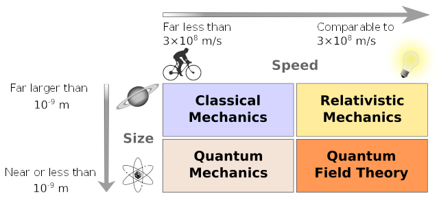

# Review of special relativity (*a hand-wavy  summary*) 

## Lorentz transformation
Consider two inertial frames (observers) $S$ and $S'$, they coincide initially. 
At time $t=0$, $S'$ is moving with a constant velocity $\vec{v}$ relative to $S$ . 
We have the freedom to choose a coordinate system, so let $\hat{x}$ be parallel to $\vec{v}$ .
In $S$ an event occurs at time $t_0$ and position $(x_0,y_0,z_0)$, from the perspective of $S'$
the same event occurred at $x'$ coordinate $x' = \gamma (-vt_0 + x_0)$ , which can be interpreted as the result of length contraction. This should be true the other way around: $x_0 = \gamma(vt' + x')$ , which can be understood as $S$ moving with velocity $-\vec{v}$ relative to $S'$ .  $t'$ can be obtained with this relation. $$ \begin{gather*}
\gamma vt' = x_0 - \gamma x' = x_0 - \gamma^2(x_0 - vt_0) \\
t' = \frac{(1 - \gamma^2)}{\gamma v}x_0 + \gamma t_0 \\
t' = \gamma \left[\left(\frac{1}{\gamma^2} - 1\right )\frac{x_0}{v} + t_0 \right] = \gamma \left(\frac{v}{c^2}x_0 + t_0\right)
\end{gather*}$$
The remaining $y,z$ components are left unchanged. However, things become much more complicated when there are multiple reference frames and $\vec{v}$ can be pointing anywhere, which brings us to the next topic.
## Four-vectors
A convenient way to keep track of the components and simplify notation is to introduce four-vectors. It can be viewed as a vector in the four-dimensional spacetime. 
In the Cartesian coordinate system, a vector's norm is unchanged under translation or rotation. The four-vector analog to this property is the Lorentz invariant, which is defined as: $(\Delta t)^2 - (\Delta x)^2-(\Delta y)^2-(\Delta z)^2$ . We define the scalar product of four-vector is as: $\mathbf{A}\cdot\mathbf{B} = A^\mu \eta_{\mu\nu} B^\nu \equiv x^\mu x_\mu = A^0B^0 - A^1B^1-A^2B^2-A^3B^3$ , where $\eta$ is termed the *metric* (or $g_{\mu\nu}$ from this point onward). The *self scalar product* or the "norm" $(A^0)^2 - (A^1)^2-(A^2)^2-(A^3)^2$  is evidently invariant. 

The convention we use for position-time and energy-momentum four-vector is $(ct, x,y,z)$ , and $(\frac{E}{c},p_x,p_y,p_z)$  respectively.
* **Contravariant vectors** (informally, the "ordinary" vector): *contra* indicating *opposing*; the components of contravariant vectors change oppositely to the change in the basis vector. For example, by scaling the basis vector from 1 cm to 1m, a vector originally $(1,0,0)$ is now $(0.01,0,0)$. We denote contravariant four-vectors with the Einstein summation index as a superscript, i.e. $x^\mu$  
* **Covariant vectors**: Having already defining the contravariant vector, covariant vectors change *with* the basis vectors. We denote covariant vectors with the summation index as a subscript, i.e. $x_\mu$ 

That which *varies* here refers to not the vector itself, but the components. For example, applying Lorentz transformation to four-vectors $x^\mu$ and $x_\mu$ , we expect the *change* in each component to be *contrarily* related, and in a way negating such transformation, therefore allowing $x^\mu x_\mu$ to remain invariant.
A metric tensor can transform one of these two types of four-vectors to the other. Our convention here is:
$$
g_{\mu\nu} = \begin{pmatrix}1&0&0&0\\0&-1&0&0\\0&0&-1&0\\0&0&0&-1\end{pmatrix}$$
Otherwise known as the *particle physics* convention. 
This is termed a *metric* in a sense that we are able to calculate a "distance". 
$$(ds)^2 = (dx^0)^2 - (dx^1)^2 - (dx^2)^2 - (dx^3)^2 = g_{\mu\nu} dx^\mu dx^\nu$$
Previously introduced as the Lorentz invariant, $g_{\mu\nu}$ is the metric tensor used in *flat spacetime* that defines such "distance". When viewed as a matrix, it is symmetric and diagonal, evidently, the four-vector component products only yields non-zero terms when the indices $\mu=\nu$ , where the metric tensor is non-zero, i.e. the diagonal. Without going into much detail, the inverse metric tensor is defined such that $g_{\mu\lambda}g^{\lambda\nu} = \delta_\mu^\nu$ . If we are also to view $g^{\lambda\nu}$ as a matrix, it would be identical to $g_{\mu\nu}$ , more explicitly: $\mathrm{diag}(1,-1,-1,-1)$. This can be used to *raise or lower* the summation indices, i.e. $g_{\mu\nu} x^\mu = x_\nu$, $g^{\mu\nu}x_\nu = x^\mu$ following the summation and contraction rules. This "tool" will be used extensively in cross-section, decay rate calculations.
 
## Particle dynamics
* **Natural units**: We will work in "God-given" units, where $\hbar = c =1$
* **Invariant mass**: A particle defined by an energy-momentum four-vector $(E,p_x,p_y,p_z)$ ^[Here we take as $c = 1$ in $E/c$  per the natural units]  . By calculating the Lorentz invariant: $E^2 - {p_x}^2- {p_y}^2- {p_z}^2$ we immediately identify $\sqrt{E^2 - |\mathbf{p}|^2} = m$ as the energy-momentum relation in special relativity, we call $m$ the **invariant mass**. 

* **Degrees of freedom** : When describing a system with infinite (continuous) degrees of freedom, we resort to understand the interactions through *field equations* , where physical quantities are assigned over all space and time. To name examples: general relativity, fluid mechanics, and electrodynamics. Among the three, electrodynamics is characterized as a *relativistic* field theory.

* **Quantum operators** : Quantum mechanics revolves around the study of a unique equation of motion: the Schrödinger equation. It is also a *wave* equation, with plane wave solutions, more precisely, the **superposition** of all plane waves. The evolution can be expressed by *algebraic operations* on wave *functions*, or alternatively view the wave functions as a vectors in a Hilbert space, and the equivalent operations are carried out using *quantum-mechanical operators* ,  acting on  a *state vector* instead of a  mathematical functions. Evidently, we can see the parallel between wave superposition and the superposition of (state) vectors. Physical observables can be represented by *Hermitian* linear operators acting on the Hilbert space (spanned by a set of basis vectors). Eigenstates of the observable have eigenvalues as the corresponding physical quantity, analogous to the superposition of plane wave solutions, or rather *eigenfunctions*. $$ \frac{\mathrm{d}f}{\mathrm{d}t} = \{f,H\} + \frac{\partial f}{\partial t} \Rightarrow \frac{\mathrm{d}\hat{f}}{\mathrm{d}t} = -\frac{i}{\hbar}[\hat{f},\hat{H}] + \frac{\partial \hat{f}}{\partial t}
  $$> From Hamilton's equation to Heisenberg equation
  
* **Quantization** : From classical to quantum mechanics, the position and momentum variables are promoted to Hermitian operators. The central relation between these operators is the *canonical commutation relation* $[\hat{X},\hat{P}]= i\hbar$ ,  the quantum analog of *Poisson brackets* in classical mechanics, which governs the time evolution of a *Hamiltonian dynamical system* . It also manifests as the *uncertainty principle* . Working with operators has the advantage of being *concise* , this will be greatly appreciated when the subject system consists of multiple bodies. In single particle quantum systems, we deal with a collection of quantum states, in multi-particle quantum systems, the discussion turns to a collection of particles each with a collection of quantum states. If we promote the state vectors to multi-particle state vectors, then the operators must also be treated by what is termed **second quantization** . Using the annihilation and creation operators alongside the original single particle observable, we may compactly express and work with the interactions and evolution of multi-particle states. Through imposing the commutator and anticommutator relation, we arrive at a theory for bosons and fermions respectively. $$
  \begin{gather*}\Psi = \prod_{i=1}^N\psi_{\alpha i} \equiv \psi_{\alpha 1}\otimes \psi_{\alpha 2} \otimes \dots \otimes \psi_{\alpha N} \Rightarrow \ket{n_{\alpha 1}, n_{\alpha 2}\dots n_{\alpha N}}\\ \hat{o} = \sum_\alpha o_\alpha \ket{\alpha}\bra{\alpha} \quad o_\alpha = \bra{\alpha}\hat{o}\ket{\alpha} \Rightarrow \hat{\mathcal{O}}_1 =\sum_\alpha o_\alpha \hat{n}_\alpha =\sum_\alpha \bra{\alpha}\hat{o}\ket{\alpha} \hat{a}_\alpha^\dagger \hat{a}_\alpha\end{gather*}$$ > From "*What state is each particle in?*" to "*How many particles in each state?*"
  
* **Harmonic Oscillators** :  Hamiltonian of the quantum harmonic oscillator (quadratic potential)
  $$\hat{H} = {\hat{p}^2 \over 2m} + \frac{1}{2}m\omega^2\hat{x}^2 \Rightarrow\hat{H} = \omega \left(\hat{a}^\dagger \hat{a} + \frac{1}{2}\right)$$
  Classical Hamiltonian of electromagnetic fields: 
  $$ H = \frac{1}{2}\epsilon_0 \iiint_V \left( |\mathbf{E}|^2+|\mathbf{B}|^2\right)\mathrm{d}^3\mathbf{r} \quad \text{plane wave solution}\Rightarrow V \epsilon_0 \sum_\mathbf{k}\sum_{\mu}\omega^2 \left[ \bar{a}_\mathbf{k}^{(\mu)}a_\mathbf{k}^{(\mu)}+a_\mathbf{k}^{(\mu)}\bar{a}_\mathbf{k}^{(\mu)}\right]$$
  This is achieved by a Fourier decomposition of the field into plane waves. $a_\mathbf{k}^{(\mu)}$ are the Fourier coefficients that define the vector potential.
  Quantization of the electromagnetic field:
  $$\begin{align*}&a_\mathbf{k}^{(\mu)}\Rightarrow\sqrt{{1\over2\omega V \epsilon_0}}\bar{a}^{(\mu)}(\mathbf{k})\quad\text{Annihilation operator}\\&\bar{a}_\mathbf{k}^{(\mu)}\Rightarrow\sqrt{{1\over2\omega V \epsilon_0}}{a}^{\dagger(\mu)}(\mathbf{k})\quad\text{Creation operator}\end{align*}$$
  substituting in the operators gives the Hamilton operator of the electromagnetic field
  $$
  \hat{H}=\sum_{\mathbf{k},\mu}\omega\left(\hat{a}^{\dagger(\mu)}(\mathbf{k})\hat{a}^{\mu}(\mathbf{k}) + \frac{1}{2}\right)
  $$ 
## Path integrals  
$$
\bra{\Omega}T\{\phi(x_1)\phi(x_2)\dots\phi(x_n)\}\ket{\Omega} = {\int \mathcal{D}_\phi \phi(x_1)\phi(x_1)\dots\phi(x_n)\exp(iS[\phi])\over\int \mathcal{D}_\phi\exp(iS[\phi])}
$$
For a time independent Hamiltonian, we can solve for the matrix elements:
$$\braket{f|i}=\bra{x_f}e^{-i(t_f - t_i)\hat{H}}\ket{x_i} $$ If we assume $\hat{H}$ as a smooth function of $t$ ,  we can solve for the matrix element using infinitesimal time intervals $\delta t$.
$$ 
\braket{f|i}=\int\mathrm{d}x_n\dots\mathrm{d}_1 \bra{x_f}e^{-i\hat{H}(t_n)\delta t}\ket{x_n}\bra{x_n}\dots\bra{x_2}e^{-i\hat{H}(t_1)\delta t}\ket{x_1}\bra{x_1}e^{-i\hat{H}(t_i)\delta t}\ket{x_i}
$$
The path integral accounts for all possible paths in the time interval, each path is "weighted" by a phase factor dependent on the action along this path. Repeatedly insert a complete set of momentum eigenstates and employing Gaussian integrals, the expression reduces to:
$$
\braket{f|i} = (\text{constants})^n \int \mathrm{d}x_n\dots\mathrm{d}x_1e^{i\mathcal{L}(x_n,\dot{x}_n)\delta t}\dots e^{i\mathcal{L}(x_1,\dot{x}_1)\delta t}{\underset{\text{continuous limit}}{\Rightarrow}} \braket{f|i} = C^n \int_{x(t_i)=x_i}^{x(t_f)=x_f}\mathcal{D}x(t)e^{iS[x]}
$$
Where $\mathcal{D}x$ is a sum over all paths, and $S[x]$ is the action from integrating the Lagrangian $\mathcal{L}$ 
## Bridging quantum mechanics and special relativity: Quantum Field Theory
### Canonical quantization (second quantization) formulation (to be completed)
Quantum field operator ($\hat{\phi}$) : $$
\hat{\phi}(\vec{x}) = \int \frac{\mathrm{d}^3k}{(2\pi)^3}\frac{1}{\sqrt{2\omega_k}}\left[\hat{a}_\mathbf{k}\exp(-i\vec{\omega}\cdot\vec{x})+\hat{a}^\dagger_\mathbf{k}\exp(i\vec{\omega}\cdot\vec{x})\right]
$$ Note that $\vec{x} = (t,x,y,z)$ and $\vec{\omega} = (\omega_k,\mathbf{k})$ are four-vectors
### Path integral formulation (to be completed)

# Quantum Mechanics, but relativistic: Neutrino Oscillation 
The discovery of neutrinos: Beta decay $n \to p + e^- + \bar{\nu}$ 
Flavors of neutrinos: $\nu_e, \nu_\mu, \nu_\tau$ These are termed  *flavor eigenstates* (of the interaction Lagrangian as opposing to the *mass eigenstates* of the free Lagrangian) 
Neutrino beams (DUNE experiment): accelerated protons strike a graphite target, hard scattering processes produces particles such as pions ($\pi^\pm$) and neutrons ($n$). A positively charged pion spontaneously decays into a positive muon and muon neutrino. The remaining particles pass an absorber only neutrinos can pass through. 
One detector is near the source, and the other detector is placed very far away for the "amount of time evolution" to be appreciable. The difference in neutrino counts is the result of *oscillation*. 

Neutrino oscillation implies:
1. $\nu$ must have mass (which does not agree with the standard model) is does not move at lightspeed
2. $\nu_{e,\mu,\tau}$ are superpositions of different mass eigenstates $\nu_i\:(i\geq2)$ 
   $$\ket{\nu_\alpha}=\sum_{i=1}^3U^*_{\alpha i}\ket{\nu_i}$$ $U^*$ is a ($3\times3$) unitary matrix. Each $\ket{\nu_i}$ evolves in time separately
The time evolution operator $\exp(-i\hat{H}t)$ . In the neutrino's center-of-momentum (COM) frame, the free propagator:
$$
\ket{\nu_i,\tau} = \exp(-im_i \tau)\ket{\nu_i,0}
$$
In the lab frame, the free particle propagator takes the approximate form of $\exp(ip_i x)$ . 
The transition amplitude (propagator) :
$$
\braket{\nu_i,0 | \nu_i,\tau} = \exp[-i(E_i t- p_i x)]
$$
Since neutrinos are highly relativistic, $vt \sim ct \sim x = L \to t$  , the expression reduces to $\exp[-i(E_i - p_i)L]$  . Here, $E_i$ is the energy of the neutrino beam $(E)$, and $L$ is the distance traveled. First order expansion of the energy-momentum relation:$$
p_i = \sqrt{E^2 - {m_i}^2}\simeq E - \frac{{m_i}^2}{2E}
$$
The approximate probability of the neutrino to change from flavor $\alpha$ to $\beta$ is the squared amplitude:$$\begin{align*}
P(\nu_\alpha\to\nu_\beta)&=\left|\sum_i U^*_{\alpha i} \exp\left(\frac{-i{m_i}^2}{2E}L\right)U_{\beta i}\right|^2\\
&=\sum_{i,j}U_{\alpha i}^* U_{\beta i}U_{\alpha j}U_{\beta j}^* \exp\left(-i\frac{{m_i}^2 - {m_j}^2}{2E}L\right)\\
\end{align*}
$$ Using Euler's formula on the exponential term and denoting the exponent as $\theta_{ij}$  
$$
\cos(\theta_{ij}) - i\sin(\theta_{ij})\Rightarrow\left[1 - 2\sin^2\left(\frac{\theta_{ij}}{2}\right)\right] - i \sin(\theta_{ij})
$$
Keeping track of the real part:
 $$\begin{align*}
P(\nu_\alpha \to \nu_\beta) &= \delta_{\alpha \beta}\\ 
&- 4\sum_{i,j}\Re(U_{\alpha i}^* U_{\beta i}U_{\alpha j}U_{\beta j}^*)\sin(\frac{\theta_{ij}}{2})\\
& + 2\sum_{i,j}\Im(U_{\alpha i}^* U_{\beta i}U_{\alpha j}U_{\beta j}^*)\sin\left(\theta_{ij}\right)
\end{align*}$$ The oscillation of mass eigenstates interferes with each other, causing the appearance and disappearance of neutrinos. If neutrinos are massless, then the transition probability to a different flavor is zero. $\Delta {m_{ij}}^2$ is what causes the oscillation. We define the sensitivity factor as: $$
\frac{\theta_{ij}}{2} = \frac{\Delta {m_{ij}}^2 L}{4E}
$$ 
## 0915 Group Discussion: Neutrino Oscillation experiments

| Name of experiment | Beam Energy | Distance L | $\Delta {m_{ij}}^2$ | Neutrino Source |
|---|---|---|---|---|
|Palo Verde|~ MeV|11 m|$~10^{-3} \text{eV}^2$|Nuclear Fission|
|Chooz|~ MeV|1 km|$>8\times10^{-4} \text{eV}^2$ |Fission (Inverse beta decay)|
|Daya Bay|~5 MeV|1.9 km|$>2\times10^{-4} \text{eV}^2$|Nuclear Fission|
|RENO|2~10 MeV|~1 km|$\Delta {m_{21}}^2:\:7.9\times10^{-5}\text{eV}^2$ $\Delta {m_{31}}^2:\:2.5\times10^{-3}\text{eV}^2$|Fission (Inverse beta decay)|
|DUNE||||
|MINOS||735 km|$~2.74\times10^-3 \text{eV}^2$|Nuclear Fission|
|K2K||||Accelerator|
|KamLAND|<10 MeV|180 km||
|Homestake||$~1.5\times10^8$ km|Solar|
* Solar and Atmosphere neutrinos: deficits of electron (solar) and muon (atm.)  neutrinos with respect to predictions from models of sun and cosmic rays
* Mass hierarchy and scale: *Normal* $m_3 \gg m_2 > \>m_1$ or *inverted*  $m_2 > m_1 \gg m_3$
* 

